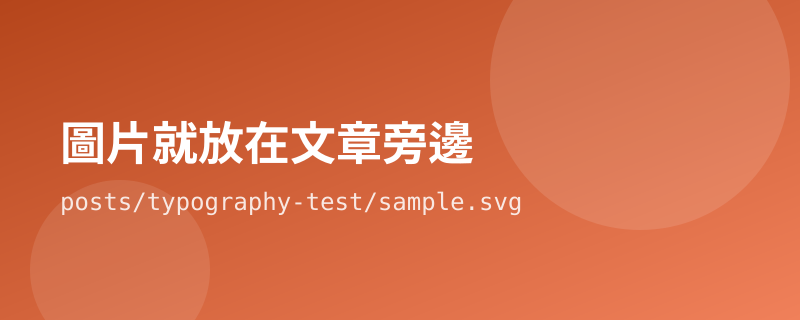

這一篇沒有實際內容，它的用途是**把所有排版元素塞在同一頁**，讓你切換亮色／深色模式時一眼看出哪裡破圖。

標題裡故意放了一個 `&` 符號，用來驗證 HTML 跳脫有沒有做對。往上看這一頁的大標題、以及瀏覽器的分頁名稱 —— 只要顯示的是一個乾淨的 and 符號，而不是一串以 amp 開頭的亂碼，就表示正常。

## 二級標題

段落文字長這樣。這裡有 **粗體**、*斜體*、`行內程式碼`、~~刪除線~~，以及一個[外部連結](https://developer.mozilla.org/)。中英文混排的時候要看行高與字距是不是舒服 —— for example, this sentence mixes English into Chinese text.

### 三級標題

#### 四級標題

## 清單

無序清單：

- 第一項
- 第二項，這一項比較長，是為了測試換行之後的縮排有沒有對齊
- 第三項
  - 巢狀項目
  - 另一個巢狀項目

有序清單：

1. 準備材料
2. 加熱
3. 等待

## 引言

> 過早最佳化是萬惡的根源。
>
> 但這句話被引用的次數，遠超過它被正確理解的次數。

## 程式碼區塊

```javascript
// 這段刻意寫得很長，用來測試程式碼區塊的橫向捲動有沒有正常運作，而不是把整個頁面撐寬。
export function slugify(input) {
  return String(input).trim().toLowerCase().replace(/\s+/g, '-').replace(/[^\p{L}\p{N}_-]+/gu, '');
}
```

## 模板語法不該被吃掉

這一段是最重要的測試。下面這行文字裡有模板佔位符的語法，如果建置腳本寫錯，它會被當成指令處理掉而消失：

原始碼裡寫的是 {{title}} 和 {{#each posts}}，你現在應該**原封不動看到這兩個東西**。看得到就代表單次掃描替換做對了。

## 表格

| 套件 | 用途 | 體積 |
| --- | --- | --- |
| `marked` | Markdown → HTML | 小 |
| `gray-matter` | 解析 front matter | 小 |
| 自己寫的模板引擎 | 套版型 | 約 50 行 |

## 圖片

下面這張圖跟這篇文章放在同一個資料夾（`posts/typography-test/`），所以路徑只要寫檔名就好：



## 分隔線

---

分隔線上下的間距應該要夠寬，不要擠在一起。

## 結尾

如果以上每一段在**亮色和深色模式下都好看**、在**手機寬度下也不會橫向捲動**，那這套 CSS 就算過關了。
